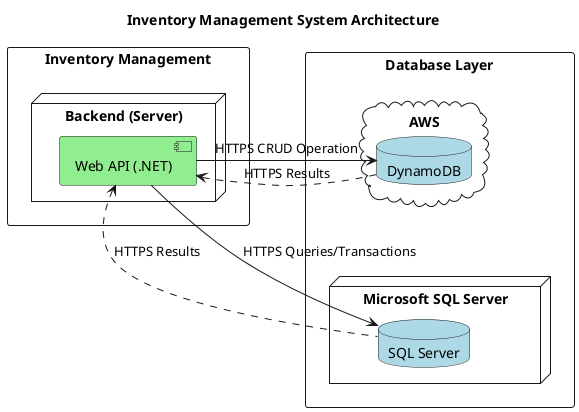
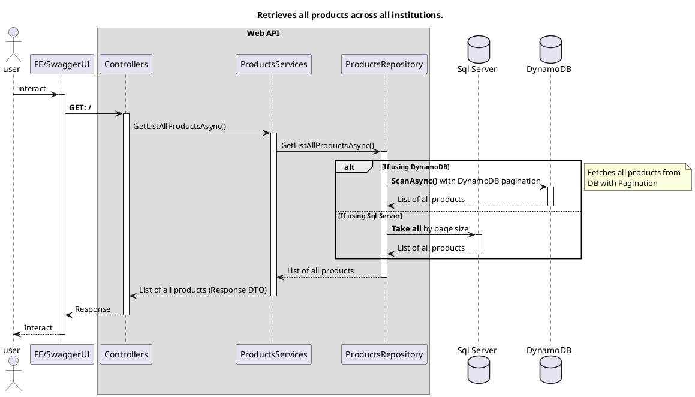
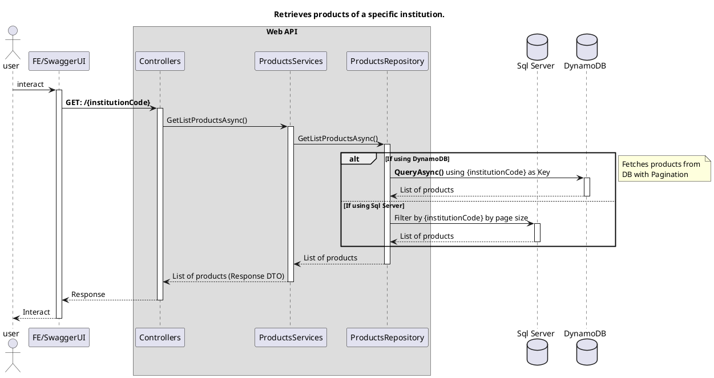
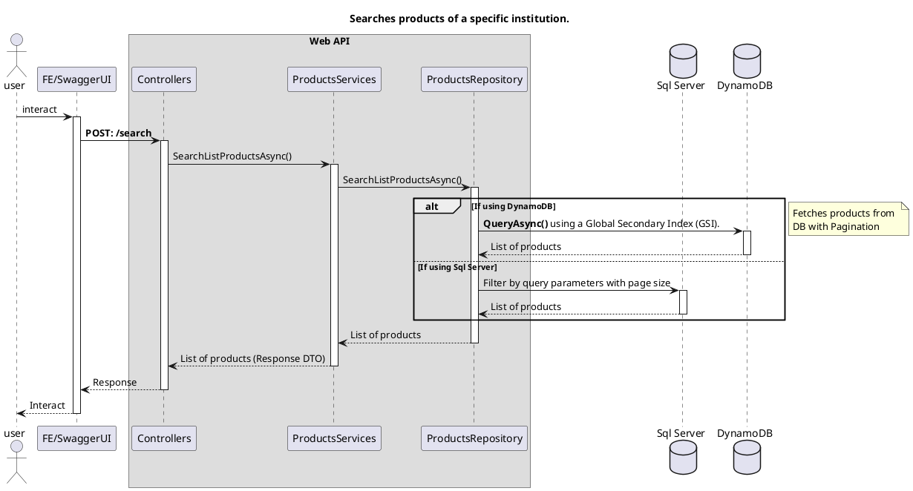
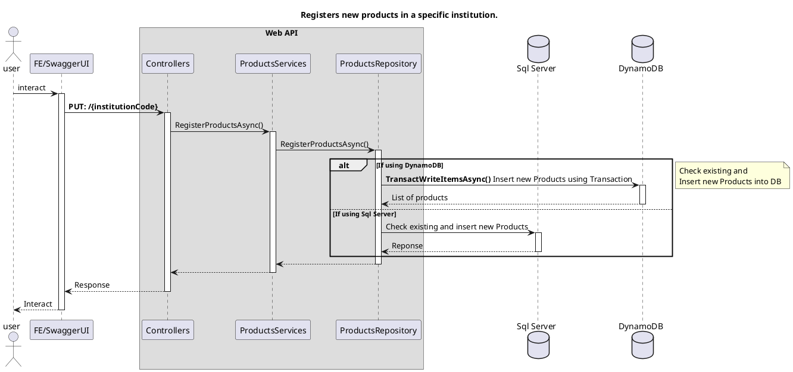
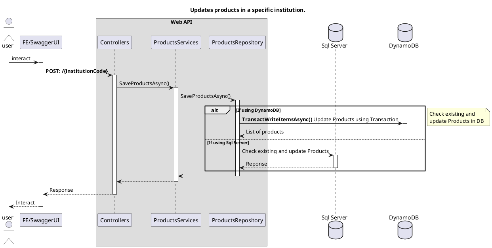

# TTH INVENTORY MANAGEMENT API

## Infrastructure

## Basic Design

## Function Design

### GetListAllProductsAsync

Retrieves all product records stored in DynamoDB.

### GetListProductsAsync

Retrieves products belonging to a specific institution.

### SearchListProductsAsync

Searches for products in a specific institution based on provided criteria.

### RegisterProductsAsync

Registers new products for a specific institution.

### UpdateProductsAsync

Updates product information for a specific institution.

