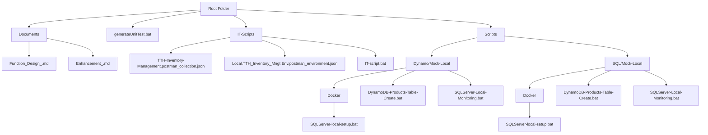

# 🧩 Environment Setup Guide

## ⚙️ 1. Infrastructure Overview

| Component | Version / Requirement | Notes |
|------------|------------------------|-------|
| **OS** | Windows 10 / 11 | Supported for main development |
| **.NET Framework** | 4.x | For legacy components (if applicable) |
| **.NET SDK** | .NET 8.0 (LTS) | Required for build & run |
| **Language** | C# | Main development language |
| **AWS CLI** | Optional | Used for AWS service integration |
| **Docker Desktop** | ✅ Required | Used to run local DynamoDB / SQLServer containers |

---

## 📁 2. Directory Tree



---

## 📚 3. Documents

### 🧠 Design

| Path | File Name | Description |
|------|------------|-------------|
| `./Documents` | `Function_Design_.md` | Function Design of WebAPI (MngtController) |
|  | `Enhancement_.md` | Next enhancement proposal |

### 🧪 Unit Test

| Path | File Name | Description |
|------|------------|-------------|
| `./` | `generateUnitTest.bat` | Script to generate UT Coverage report |

### 🔗 Integration Test (Postman)

| Path | File Name | Description |
|------|------------|-------------|
| `./IT-Scripts` | `TTH-Inventory-Management.postman_collection.json` | Postman Collection |
|  | `Local.TTH_Inventory_Mngt.Env.postman_environment.json` | Local Postman Environment |
|  | `IT-script.bat` | Local run script |

---

## 🗄️ 4. Database Scripts

### 🧩 DynamoDB (Local)

| Path | File | Description |
|------|------|-------------|
| `./Scripts/Dynamo/Mock-Local/Docker` | `DynamoDB-local-setup.bat` | Creates local DynamoDB Docker image |
| `./Scripts/Dynamo/Mock-Local` | `DynamoDB-Products-Table-Create.bat` | Creates Products table |
|  | `DynamoDB-Local-Monitoring.bat` | Starts local monitoring container |

### 🧩 SQL Server (Local)

| Path | File | Description |
|------|------|-------------|
| `./Scripts/SQL/Mock-Local/Docker` | `SQLServer-local-setup.bat` | Creates local SQL Server Docker image |
| `./Scripts/SQL/Mock-Local` | `SQLServer-Products-Table-Create.bat` | Creates Products table |
|  | `SQLServer-Local-Monitoring.bat` | Starts SQLServer monitoring container |

---

## 🧰 5. Local Debug

### 🧱 DB Setup

#### 🔹 Suggestion

- **Local Development**
  - Use **Docker SQL Server** for realistic environment
  - Use **SQLite** for quick prototyping
- **Unit Tests**
  - Use **InMemory provider** for fast testing

#### 🔹 If Using DynamoDB

**Windows (cmd):**
```bash
.\Scripts\DynamoDB\Mock-Local\Docker\DynamoDB-local-setup.bat
```

**Powershell / macOS:**
```bash
.\Scripts\DynamoDB\Mock-Local\Mock-Local-DynamoDB-master-script.sh
```

#### 🔹 If Using SQL Server

**Windows (cmd):**
```bash
.\Scripts\SQL\Mock-Local\Docker\SQLServer-local-setup.bat
```

**Powershell / macOS:**
```bash
.\Scripts\SQL\Mock-Local\Mock-Local-SQLServer-master-script.sh
```

#### 🔹 Expected Behavior

- Docker Image + Container are created successfully  
- `Products` table is available in local SQL DB  
- Monitor via: **http://localhost:8080/**

---

## 🚀 6. Running the Solution

### 🪟 Windows

- Open **Visual Studio 2022+**
- Run project in **DEBUG** mode

### 🍎 macOS (Apple Silicon M1 Example)

#### Install .NET 8 via Homebrew

```bash
brew install dotnet@8
```

Or download manually:  
🔗 https://dotnet.microsoft.com/en-us/download/dotnet/8.0

#### Verify Installation

```bash
dotnet --list-sdks
dotnet --list-runtimes
```

Ensure PATH setup:
```bash
echo 'export DOTNET_ROOT="/opt/homebrew/opt/dotnet@8/libexec"' >> ~/.zshrc
source ~/.zshrc
```

Your machine SDK version might be:
```bash
Installed SDKs:
8.0.120 [/opt/homebrew/Cellar/dotnet@8/8.0.120/libexec/sdk]
```

**global.json**
```json
{
  "sdk": {
    "version": "8.0.120",
    "rollForward": "latestFeature"
  }
}
```

#### Install Report Generator Tool

```bash
dotnet tool install -g dotnet-reportgenerator-globaltool
```

Add to PATH:
```bash
echo 'export PATH=$PATH:$HOME/.dotnet/tools' >> ~/.zshrc
source ~/.zshrc
```

#### Build & Run

```bash
dotnet build TTH_Inventory_Mngt.WebApi.Public
dotnet run TTH_Inventory_Mngt.WebApi.Public
```
or
```bash
dotnet watch run --project TTH_Inventory_Mngt.WebApi.Public
```

---

## 🌐 7. Swagger UI Access

Open one of the following:
- 🔹 https://localhost:7097/index.html  
- 🔹 http://localhost:5064/index.html
