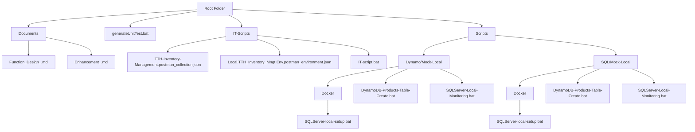

# ENVIRONMENT SETUP

## Infrastructure

- Operating System: Windows 10 or Windows 11
- .NET Framework: 4.x (for legacy components if applicable)
- .NET SDK: .NET 8.0 (LTS) – required for building and running the solution
- Programming Language: C#
- AWS CLI: Optional – used for interacting with AWS services from the command line
- Docker Desktop: Required – used to run local DynamoDB container

## Folder Structure



### Documents

#### Design

|Path|File Name|Target|
|--|--|--|
|`./Documents`|`Function_Design_.md`|Function Design of current WebApi > MngtController|
||`Enhancement_.md`|Next Enhancement for proposal|

### Unit Test

### Coverage report

|Path|File Name|Target|
|--|--|--|
|`./`|`generateUnitTest.bat`|Script to run UT Coverage report for whole the solution|

### Integration Test

#### Postman

|Path|File Name|Target|
|--|--|--|
|`./IT-Scripts`|`TTH-Inventory-Management.postman_collection.json`|Postman Collection for IT|
||`Local.TTH_Inventory_Mngt.Env.postman_environment.json`|Postman Environment for IT (Local)|
||`IT-script.bat`|Postman run script for IT (Local)|

### Database

#### Dynamo DB

|Path|File Name|Target|
|--|--|--|
|`./Scripts/Dynamo/Mock-Local/Docker`|`DynamoDB-local-setup.bat`|Script to initiate the Image for DynamoDB in Local|
|`./Scripts/Dynamo/Mock-Local`|`DynamoDB-Products-Table-Create.bat`|Script to create table in DynomoDB in Local|
||`DynamoDB-Local-Monitoring.bat`|Script to initiate container to monitor the DynomoDB in Local|

#### SQL Server

|Path|File Name|Target|
|--|--|--|
|`./Scripts/SQL/Mock-Local/Docker`|`SQLServer-local-setup.bat`|Script to initiate the Image for SQLServer in Local|
|`./Scripts/SQL/Mock-Local`|`SQLServer-Products-Table-Create.bat`|Script to create table in SQLServer in Local|
||`SQLServer-Local-Monitoring.bat`|Script to initiate container to monitor the SQLServer in Local|

## Local Debug

### DB Setup

#### Suggestion

- **For local development**:
  - Use **Docker SQL Server** for full-featured testing
  - Use **SQLite** for a lightweight, zero-setup option
- **For unit tests**:
  - Use **InMemory** provider for fast and isolated testing

#### IF DynamoDB

##### DB init

Run file dirrectly

```#!/bin/bash
.\Scripts\DynamoDB\Mock-Local\Docker\DynamoDB-local-setup.bat
```

- A New Docker Image will be created and A Container to run the Image

Run file dirrectly

```#!/bin/bash
.\Scripts\DynamoDB\Mock-Local\Docker\DynamoDB-Products-Table-Create.bat
```

- Dynamo DB Table "Products" will be created in the local Dynamo DB (Docker Image)

##### DB monitor

Run file dirrectly

```#!/bin/bash
.\Scripts\DynamoDB\Mock-Local\DynamoDB-Local-Monitoring.bat
```

- Open http://localhost:8001/ in Browser to monitor the respective Dynamo DB Local Instance

#### IF SQL Server

##### DB init

Run file dirrectly

```#!/bin/bash
.\Scripts\SQL\Mock-Local\Docker\SQLServer-local-setup.bat
```

- A New Docker Image will be created

Run file dirrectly

```#!/bin/bash
.\Scripts\SQL\Mock-Local\Docker\SQLServer-Products-Table-Create.bat
```

- A Container will be created to run in the Image
- Table "Products" will be created in the local SQL Server DB (Docker Image)

##### DB monitor

Run file dirrectly

```#!/bin/bash
.\Scripts\SQL\Mock-Local\SQLServer-Local-Monitoring.bat
```

- Open http://localhost:8080/ in Browser to monitor the respective SQL Server DB Local Instance

### Solution Run

- Run Solution using Visual Studio 2x version
- Run Solution in DEBUG mode

### Swagger UI

- Open https://localhost:7097/ or http://localhost:5064/ in Browser
