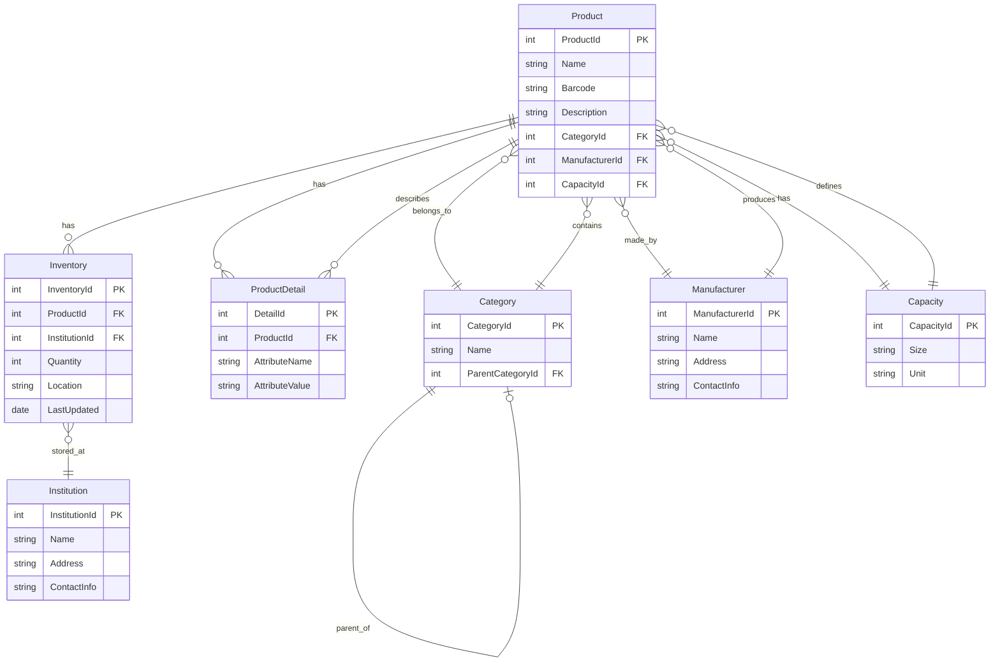

# Enhancement proposal

## 1. Improving Search Efficiency & Responsiveness

### DynamoDB Side

- Improve from current implementation
  - Use Global Secondary Indexes (GSIs) wisely: Create indexes on the most queried attributes (e.g., InstitutionCode, ProductName, Category, Manufacturer). Avoid full table scans.
  - Pagination + relevance ranking.
  - Composite Keys for Search: Use partition key + sort key combinations (e.g., InstitutionCode as PK, ProductName as SK) to support fast prefix search.
  - DynamoDB Streams + ElasticSearch (OpenSearch Service): For advanced text search across multiple attributes, stream DynamoDB changes into AWS OpenSearch (Elasticsearch)
    - Full-text search
    - Fuzzy search
    - Faceted search

### SQL Server Side

- Improve from current implementation
  - Full-Text Indexing: Use SQL Server’s built-in Full-Text Search (FTS). It supports natural language queries, ranking, and indexing multiple attributes (product name, description, manufacturer).
  - Caching Layer: Introduce Redis for caching frequent queries or search results.
  - Pagination + Async Queries: Ensure all EF Core queries use AsNoTracking() + proper pagination (Skip / Take).
  - Connection Pooling: Configure EF Core and SQL Server for pooled connections to avoid delays under load.

**In case of instant search (like autocomplete) across all product attributes:**

- Keep DynamoDB as the source of truth
  - Stream data into OpenSearch (AWS-managed Elasticsearch)
  - Query OpenSearch for searches → Return product IDs → Fetch details from DynamoDB/SQL only when needed
  - This hybrid pattern gives both speed and consistency.

## 2. Bigger Picture of Data Model (EF Core Design)

- For an Inventory Management System

- *Information*

Product
 ├─ ProductId (PK)
 ├─ Name
 ├─ Barcode
 ├─ Description
 ├─ CategoryId (FK)
 ├─ ManufacturerId (FK)
 └─ CapacityId (FK)

Category
 ├─ CategoryId (PK)
 ├─ Name
 └─ ParentCategoryId (self-FK, nullable)  ← supports hierarchy

Manufacturer
 ├─ ManufacturerId (PK)
 ├─ Name
 ├─ Address
 ├─ ContactInfo

Capacity
 ├─ CapacityId (PK)
 ├─ Size
 ├─ Unit (e.g., ml, g, L, pcs)

Inventory
 ├─ InventoryId (PK)
 ├─ ProductId (FK)
 ├─ InstitutionId (FK)
 ├─ Quantity
 ├─ Location
 ├─ LastUpdated

Institution
 ├─ InstitutionId (PK)
 ├─ Name
 ├─ Address
 └─ ContactInfo

ProductDetail
 ├─ DetailId (PK)
 ├─ ProductId (FK)
 ├─ AttributeName
 ├─ AttributeValue

- Relationships

One Product → Many Inventories (per institution/warehouse).

One Category → Many Products (supports hierarchy with ParentCategoryId).

One Manufacturer → Many Products.

One Capacity → Many Products.

One Product → Many ProductDetails (flexible attributes, e.g., “Color=Red”, “Weight=200g”).
